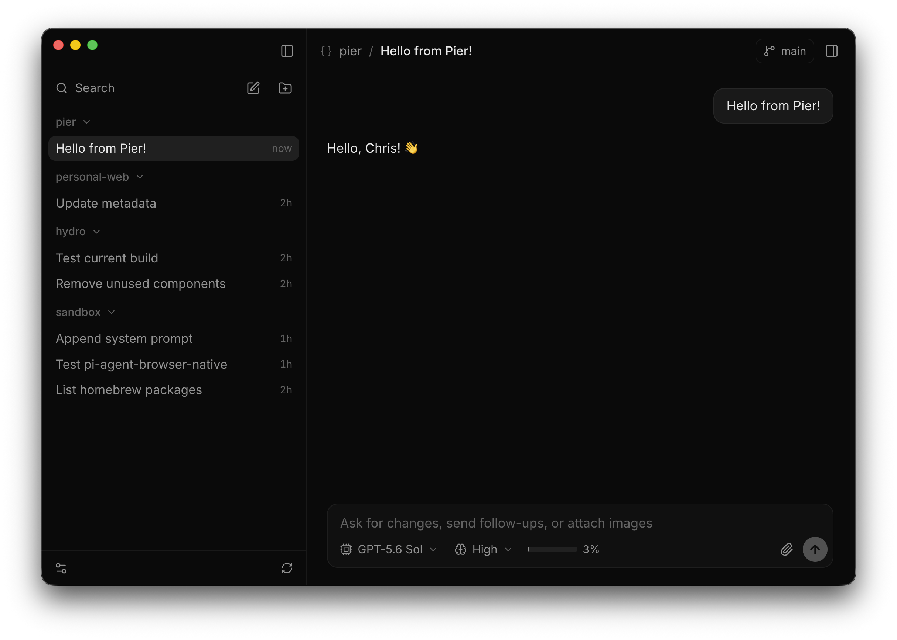

# Pier

**Pier** is a desktop GUI client (currently macOS-only) for the [pi](https://pi.dev) coding agent.

The app uses the `pi` setup that you already have installed. It spawns `pi --mode rpc` per open session, so your models, settings, extensions, and slash commands still work like you expect, and you can resume a Pier session in pi in the terminal using `pi -c`.

## Installing the DMG

Right now the app is ad-hoc signed and not notarized, so the first launch shows a Gatekeeper prompt - you will need to open "System Settings" > "Privacy & Security", then click "Open Anyway".

When a new release is available, the app updates itself automatically without any Gatekeeper prompt.

## Requirements

- macOS on Apple silicon
- `pi` 0.85 or newer on PATH (see https://pi.dev for installation instructions)

## What it does

- Lists every project pi has run in, derived from `~/.pi/agent/sessions`, with the sessions under each
- Streams the transcript: markdown, collapsed thinking, tool calls with live output, edit diffs inline
- Composer with `/` commands from pi, `@` file mentions, image paste, and ArrowUp history
- Follow-up queue while a turn runs, with promotion to steering
- Model and thinking-level pickers, a context meter, and the status text your extensions publish
- Read-only diff of the project's working tree against HEAD, refreshed as files change, plus a login shell in the project directory
- Current git branch in the header
- Extension dialogs (select, confirm, input, editor) rendered as sheets, notifications as toasts
- Unread and needs-input markers in the sidebar and a Dock badge

App-only preferences live in `~/.pi/gui/settings.json`, everything else stays in pi's own configuration.
